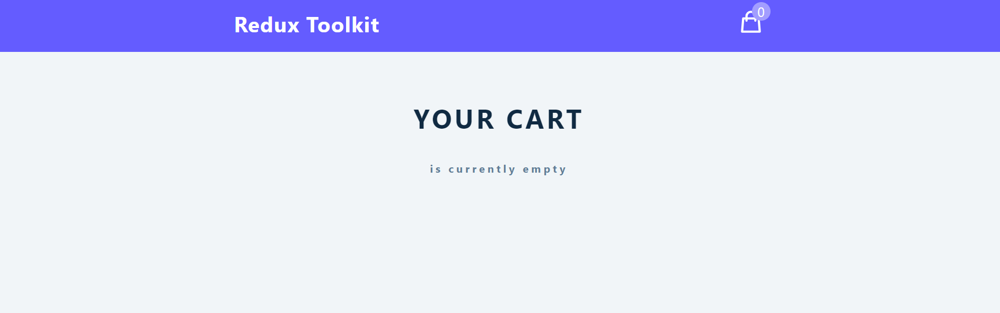
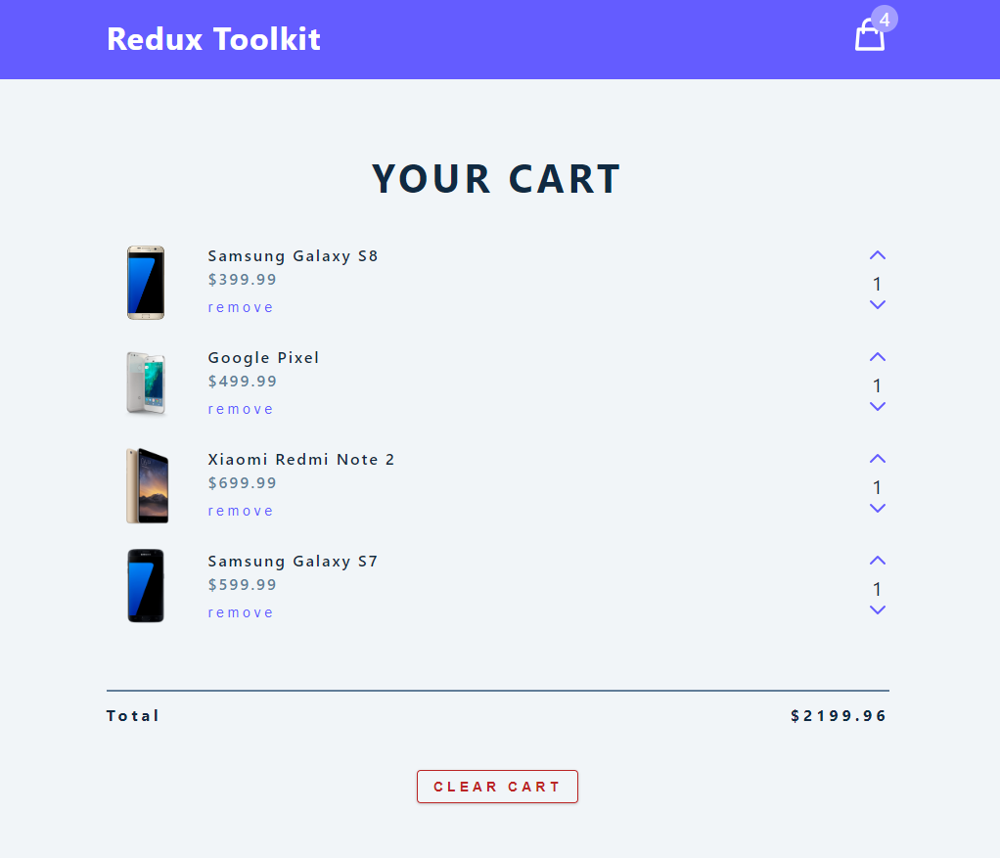
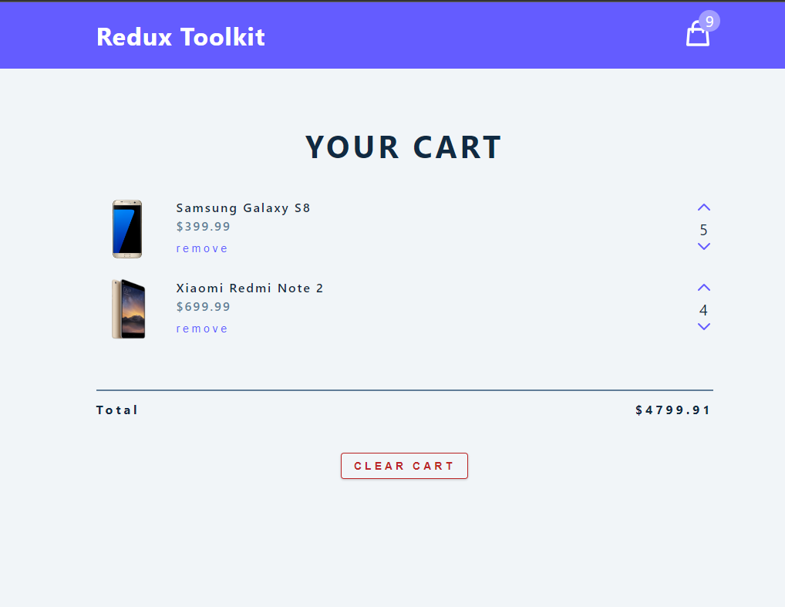
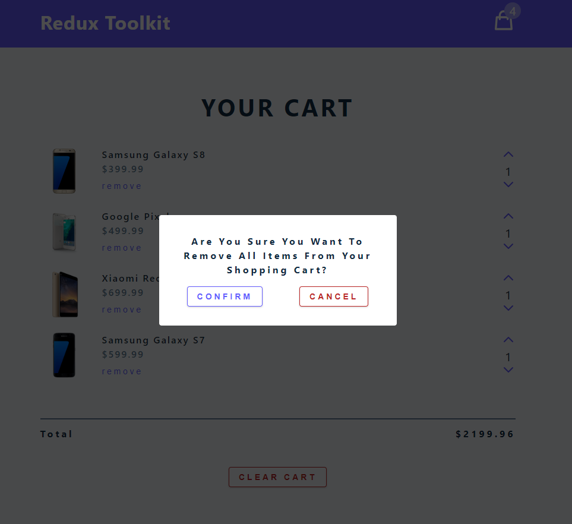

# This project was used to learn the basics of Redux toolkit by creating a simple cart application.

## The components of this project are the navbar, cart container, cart item and the modal.

### Here, the store which is the core of redux houses the cartSlice and modalSlice which are the reducers that control the state and actions of the entire application.

#### When the cart is empty it displays as follows. The icon at the right top show the number of items in the cart

---

#### When the cart has items it displays as follows with the item count displayed at the top and total price at the bottom.

#### The cart has functionality to add or subtract the amount of each specific item or remove it from the cart or clear the entire cart.

#### Clearing the cart pops up the modal to confirm or cancel that action

